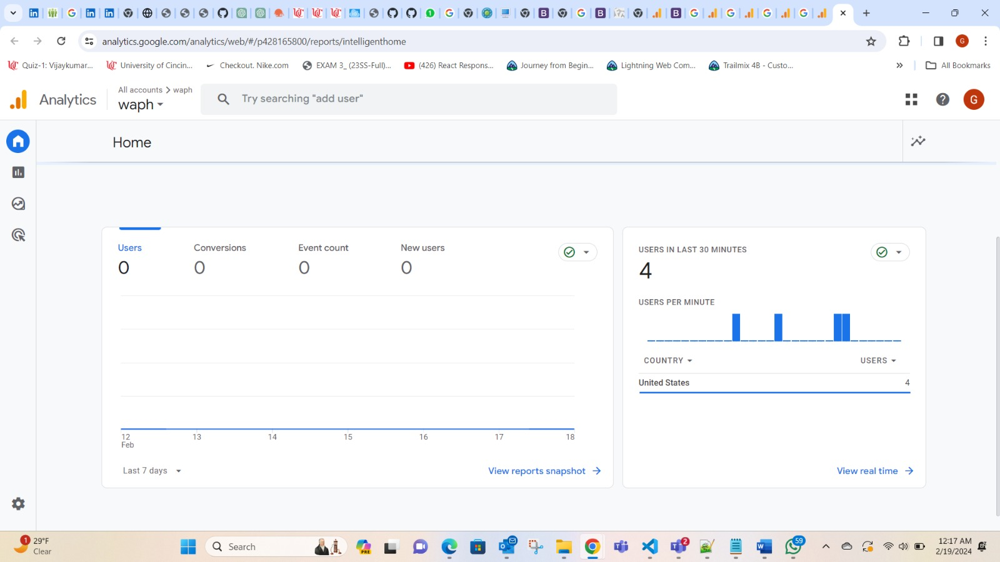
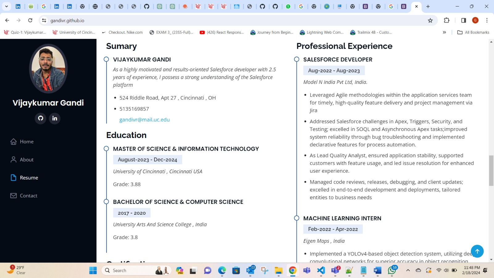
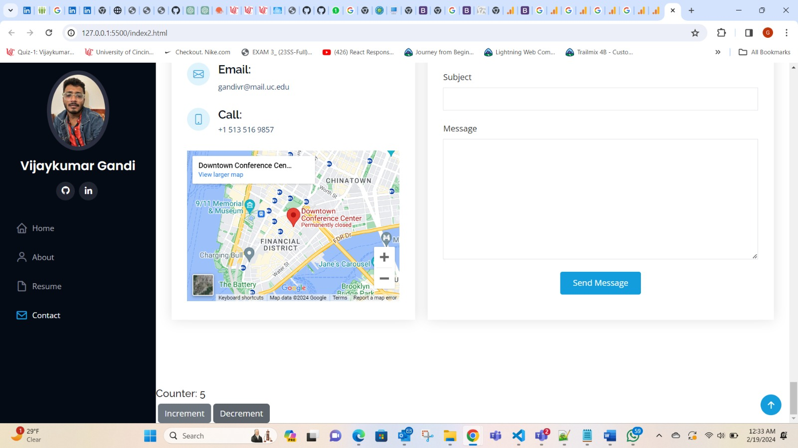
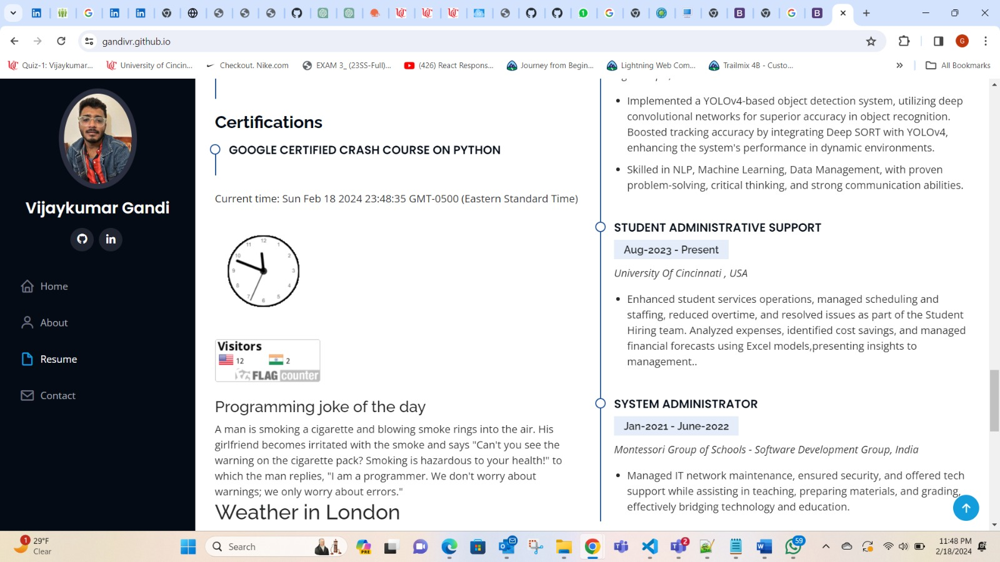
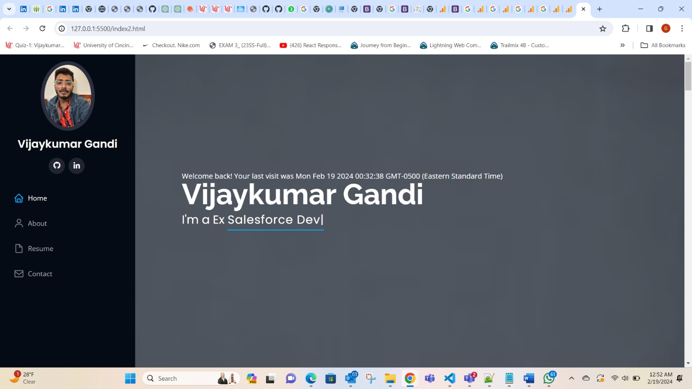

# WAPH - Web Application Programming and Hacking

## Instructor: Dr. Phu Phung

## Student 

**Name** : Vijaykumar Gandi

**Email** : gandivr@mail.uc.edu

**Profile Pic** : 
 

## Repository: 

** REpOsitory URL**: [https://github.com/gandivr/gandivr.github.io](https://github.com/gandivr/gandivr.github.io)

## Website:

[https://gandivr.github.io/](https://gandivr.github.io/)

## Project-1 overview

In this project, we will Build a professional profile on GitHub Pages with resume, course details, using Bootstrap, JavaScript, jQuery, and integrate two Web APIs. Include clocks, email toggle, and personalize visitor greetings with cookies. This project has general, non-technical, and technical requirements.

## General Requirements:

Created and deployed a personal website on github.

## Non Technical REquirements:

Created a google ANalytics account and included a page tracker.

 

## Technical Requirements:

In this section I have included Digital clock, analog clock and show my email functionality

Aditionally for this i have added a Counter functionality

##  Two PUblic APis Generation:

Here i integrated the JokeAPI

## Javascript Cookie:

Here i used Javascript cookie , which displays welcome message.

